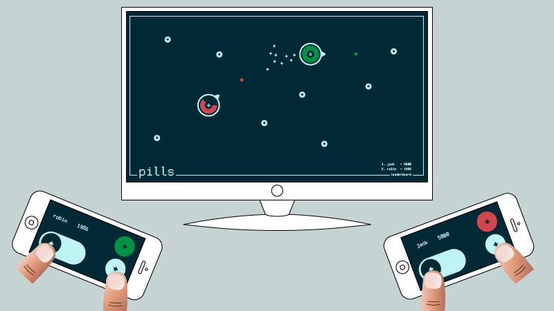

# Pills
A multi-device websocket experiment. 

Pills is a 2d multiplayer game which runs in your browser. 
Each player controls its character with his smartphone.

### How to setup

1. Clone the repository
2. Requires node.js and npm installed
3. run `npm install`
4. run `node web.js`

### How to play (on local network)

1. On a large screen go to <your-ip-address>:5000/game.html
2. Joint from your smartphone at <your-ip-address>:5000/ctrl.html
3. Type in the code you see on screen, and a name of your choice.

### Warning

This is a Chrome experiment.
This experiment has been tested with a laptop running the game on Google Chrome and an iPhone4S runnign the controller on Google Chrome for iOS.

### Under the hood

The game relies on a [Node.js](http://nodejs.org/) server running [Express](http://expressjs.com/) to serve static content and [Socket.io](http://socket.io/) to manage the communication between devices.

The graphics has been developed using the [HTML5 Canvas API](http://diveintohtml5.info/canvas.html), with the help of an extension to the physics module from [Toxiclibs.js](http://haptic-data.com/toxiclibsjs/) I developed to handle behaviors affecting separate groups of particles.

The responsive mobile app makes use of [JQuery](http://jquery.com/) and [Bootstrap](http://getbootstrap.com/).

